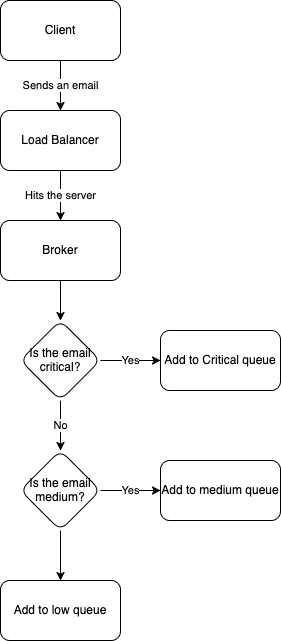
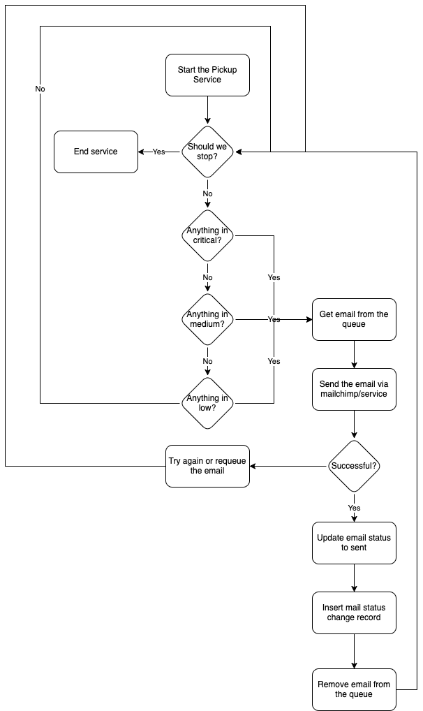
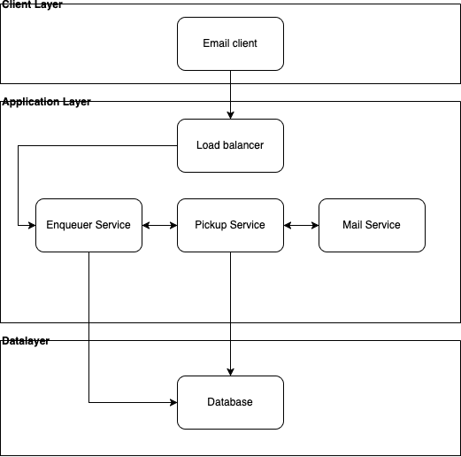

# AgentLocator Email Server Problem
Using cloud or on prem (example Azure & managed servers) design email sending system. What you need to design is a module that will receive email subject, content and attachment through api endpoint, store it into the database and send to the receiver using service like MailGun or MailChimp. The module will also store information about email statuses ( sent, received, opened ) through webhooks. Design the system to be as resilient as possible. There are emails with three levels of priority:

1. Critical - must be sent inside up to 15 seconds ( no bursts, up to 10 K emails per day )
2. Medium - must be sent inside 15 minutes ( up to 200 K per day, there can be bursts of emails sent, mostly during working hours )
3. Low - must be sent inside an hour from being received - up to 1 M a day.


You answer needs to contain:
1. List of main recognized risks ( any risk you can think of ) and solutions
2. How would you structure the data
3. Diagram of the solution with explanations and available actions on each part of the system

# Personal Solution
We can break the problem down into a few smaller problems:
1. "module that will receive email subject, content and attachment through api endpoint"
2. "store it into the database", ie. store emails in a database
3. "send to the receiver using service like MailGun or MailChimp"
4. "store information about email statuses (sent, received, opened) through webhooks"
5. "Critical Priority - < 15s"
6. "Medium Priority - <15m"
7. "Low Priority - <60m"

## Database Design

First, we can start with some basic database design (points #2 and #4). Since we need to design a system "as resilient as possible", we can assume that our email statuses may change in the future. For example, a "replied" status may be added. We can create a database table that will handle our statuses:

```
Table: "STATUSES"
- ID
- STATUS_NAME
```

Next, we can create our main "EMAIL" table which may look like this:

```
Table: "EMAILS"
- ID
- SENDER_EMAIL
- RECIPIENT_EMAIL
- SUBJECT
- CONTENT
- PRIORITY
- STATUS_ID (FK - STATUS.ID)
- ATTACHMENT_ID
- CREATE_DATE_TIME
```

Since we can upload one attachement to a single email, we'll need a way to reference the attachments. We can create a table that stores attachments with a reference to the EMAIL.ID field so that we know what email the attachement is a part of.

```
Table: "ATTACHMENTS"
- ID
- EMAIL_ID (FK - EMAIL.ID)
- FILE_NAME
- BLOB_LOCATION
```

We might also choose to keep a track of when status changeS for each email. We can do so by creating a new table that stores the status and the date of the change:

```
Table: "STATUS_CHANGE"
- EMAIL_ID (FK - EMAIL.ID)
- STATUS_CHANGED_TO
- CHANGE_DATE_TIME
```

## Email Handling

### Enqueuer

Let's assume that we have one single service running on a single thread, ie. the server can only handle processing one email at a time. We also know that there are 3 priority types - low, medium and critical. To handle each priority, we can create 3 queues in our service that will operate on a first-in-first-out basis, based on the time they were sent.

Let's assume we have our priority queues named PQ_Low, PQ_Med and PQ_Cri. We will insert the emails into each queue based on their priority. The pseudocode of the queueing process could look something like this:

```
queue_email(email):
  if email.priority = "critical":
    insert email into PQ_Cri
  else if email.priority = "medium":
    insert email into PQ_Med
  else:
    insert email into PQ_Low
```

<div style="text-align: center;">
   
</div>

### Pickup Service

We will need a service that runs indefinitely on our server, with the option to stop the service. We know that we need to deliver our most critical emails as soon as they com in, so critical emails need to be added to our PQ_Cri and handled right away. Hence, we need to make sure to process all critical emails before attempting to process any medium or low emails. The same goes for medium emails, if there are no critical emails, we must process medium priority emails before attempting to process low priority emails. Keeping in mind what we said earlier - single service on a single thread, we can have pseudocode similar to something like this:

```
while(true):
  if stopped:
    return
  
  if PQ_Cri has items:
    get first email in PQ_Cri
    send the email via mail service
    if successful:
      update email status to sent
      insert email status change record
      pop email from PQ_Cri
    continue
  else if PQ_Med has items:
    get first email in PQ_Med
    send the email via mail service
    if successful:
      update email status to sent
      insert email status change record
      pop email from PQ_Med
    continue
  else if PQ_Low has items:
    get first email in PQ_Low
    send the email via mail service
    if successful:
      update email status to sent
      insert email status change record
      pop email from PQ_Loq
      continue
```

This is a very basic approach. If we want to make this a very fault tolerant system, we may include things like send re-try or re-queue. It all depends on the error code that is returned from the mail service. If the mail service is down at the moment, we may opt to re-queue the email to the end of the list so that our service can retry again at a later time. If the service is online but the response is a failure, then we know something is wrong with the original email, maybe the receipient email is wrong, attachments are corrupted, whatever the reason may be. If this is the case, we may choose to remove the email from the queue and notify the sender that their email has failed.

If we had multiple services at our disposal, ie. one server per queue, we could approach this the same way but we would not check the other queues, we would just look at a single queue.

<div style="text-align: center;">
   
</div>

## API Endpoint Design

Next, we can look at building out our API endpoint that will initiate the logic of storing and sending the email (item #1). Since we're uploading data, we can use a POST REST endpoint with a form-data content type. Since the question says "attachment" and not multiple attachments, we can assume that each email can have at most one attachment. The request can look something like this:

```
POST /api/send
Headers:
  Content-Type: "form-data"
Body:
  sender (text): "sender@email.com"
  receiver (text): "receiver@email.com"
  subject (text): "email subject"
  content (text): "email content goes here..."
  priority (text): "low/medium/critical"
  attachment (file): attachment.zip
```

Once this request hits the server, we can initiate the logic behind the endpoint which would insert the email to the queues mentioned in the section above. The sender service will take care of everything after. We can return a 200 success if the email has been queued up correctly.

Based on my limited knowledge of mail servers (I don't know if emails are broadcasted to the recipient or if the recipient mail server polls for new emails). The "opened" endpoint is pretty straight forward, we just attach the webhook to the email so that on load, it initiates a GET request to an endpoint to update the email status. Something like this could look like:

```
GET /api/email/{id}/open

Where "id" is the ID of the email being opened.
```

When it comes to flagging the email as successfully "receieved", I'm not too sure how we could do this without me researching more about how mail servers work and how a service like mailchimp can guarantee that an email has been received, not gone to junk, etc.

## Load Balancing

We can utilize classic load balancing to distribute our traffic across multiple servers. This will help when the services are overloaded or if one of our servers is down. The same email would not get added to two different services and we can distribute our work even further.

# High-level application diagram

<div style="text-align: center;">
   
</div>


# AI Assisted Solution
## Email Sending System Design
### Core Components

### API Layer
- API Gateway: Entry point for all email requests, handles authentication and rate limiting
- Load Balancer: Distributes traffic across multiple API servers for high availability
- API Servers: Validates requests and routes them to appropriate queues based on priority

### Message Queue System
Three separate queues for different priority levels:

- Critical Queue: Optimized for immediate processing (15-second SLA)
- Medium Queue: Handles larger volume with 15-minute SLA
- Low Priority Queue: Processes bulk emails with 1-hour SLA

### Processing Workers

Dedicated worker pools for each priority level:

- Critical Workers: Higher resource allocation, more instances
- Medium Workers: Auto-scaling based on queue depth
- Low Priority Workers: Cost-optimized for bulk processing

### Email Service Integration

- Primary and fallback email service providers (MailGun, MailChimp, etc.)
- Service-specific adapters with circuit breakers

### Storage Layer

- Main database for email content, metadata, and status tracking
- Object storage for attachments

### Webhook Handlers

- Separate service to process status updates from email providers
- Updates database with delivery status (sent, received, opened)

### Monitoring & Alerting

- Real-time monitoring of queue depths and processing times
- Alerts for SLA violations or system issues

## Database
```
Emails:
  - id: UUID (primary key)
  - priority: ENUM (critical, medium, low)
  - subject: TEXT
  - content: TEXT
  - sender: VARCHAR
  - receiver: VARCHAR
  - created_at: TIMESTAMP
  - status: ENUM (queued, sent, delivered, opened, failed)
  - last_status_update: TIMESTAMP
  - retry_count: INT
  - metadata: JSONB

Attachments:
  - id: UUID (primary key)
  - email_id: UUID (foreign key)
  - filename: VARCHAR
  - content_type: VARCHAR
  - storage_path: VARCHAR
  - size: INT

EmailEvents:
  - id: UUID (primary key)
  - email_id: UUID (foreign key)
  - event_type: ENUM (queued, sent, delivered, opened, failed, etc.)
  - timestamp: TIMESTAMP
  - provider: VARCHAR
  - metadata: JSONB
```

## Resilience Strategies

### Queue-based Architecture

- Decouples request handling from email processing
- Ensures no data loss during processing spikes or downstream failures

### Multi-provider Strategy

- Primary and secondary email service providers
- Automatic failover if primary provider experiences issues
- Provider-specific rate limiting and quota management

### Retry Mechanism

- Exponential backoff for failed delivery attempts
- Dead letter queue for emails that exceed retry limits
- Administrative interface for manual intervention

### Data Redundancy

- Database replication with automatic failover
- Periodic database backups
- Attachment storage with redundancy

#### Auto-scaling

- Worker pools scale based on queue depth and SLA requirements
- Critical workers maintain minimum capacity to handle sudden spikes


# Improvements from AI solution?
- The solution had some additional database fields which could prove to be useful.
- It introduced a "dead letter queue" which could prove to be useful for emails that have exceeded retries. Maybe we could also introduce a dead email table in the database for storing emails that have exeeded retry attempts. This would be purely for debugging purposes so that the owners of the system can see what happened with specific emails.
- It added automated database backups which I would consider a must in any system - I usually don't even think about this, I just implement it

# Additional Thoughts
After quering Claude for a solution, I realized that there was an edge case not covered by my initial solution, nor the AI. 

What happens in the case that the system is brought down unexpectedly and needs to be booted back up? How do we know the last state of the server and queues?

An improvement would be to add some additional logic to our broker piece. As soon as we get a request to send an email, we need to save that email into the database as "queued" or something similar. This will enable us to keep track of emails which were originally queued up but not sent or failed. Each time we start our service, we will query the emails table for records in this new "queued" state, and re-queue them into their respected queues based on creation date/time and priority. This would allow our system to pickup exactly where it left off in the case of some kind of downtown or restart.
